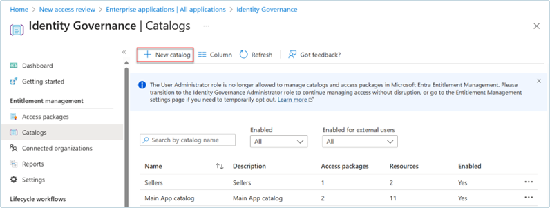
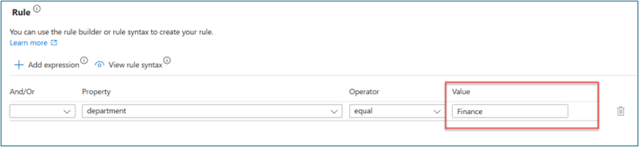
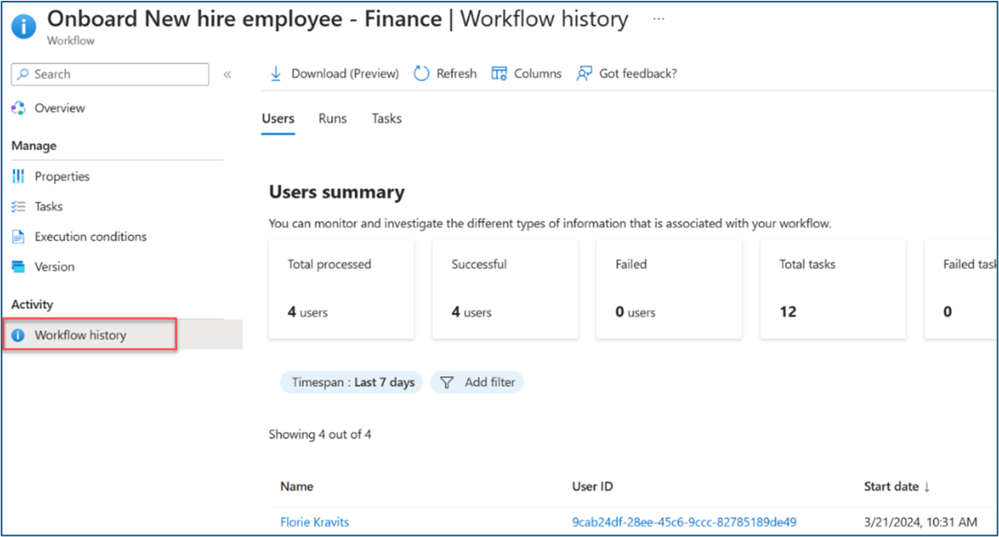
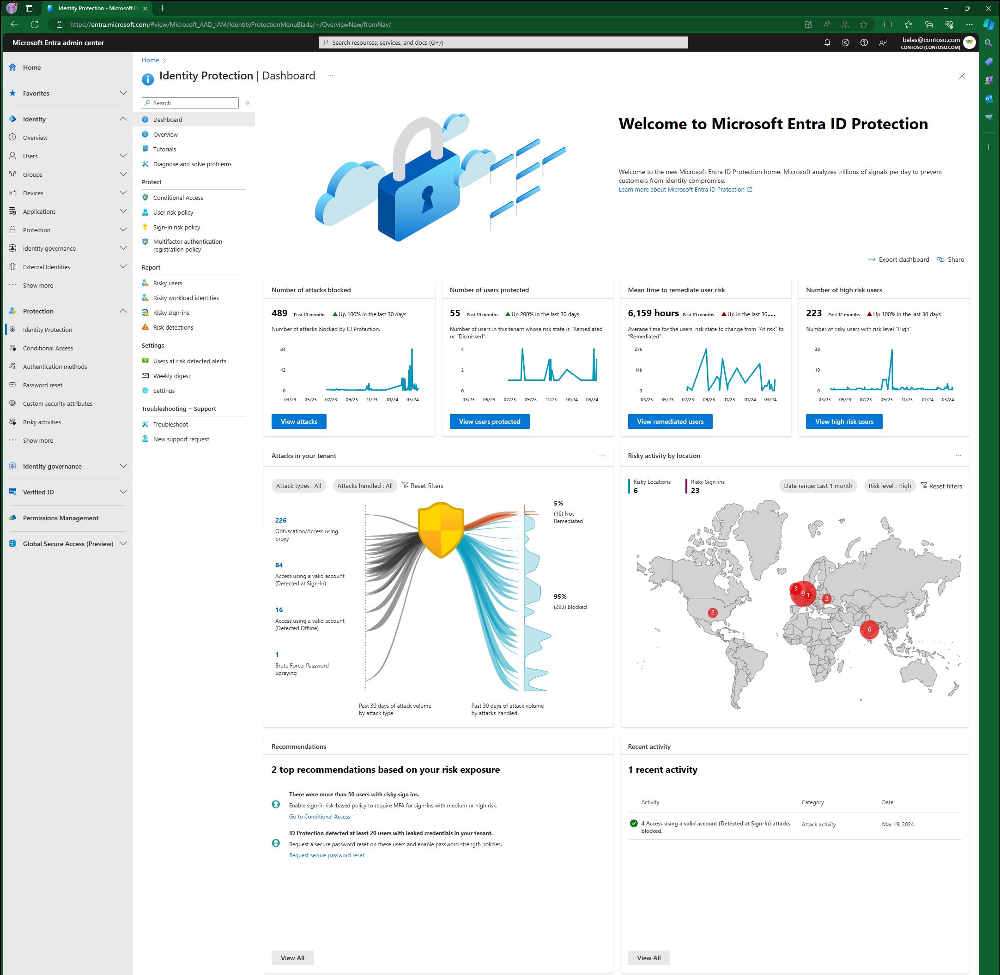
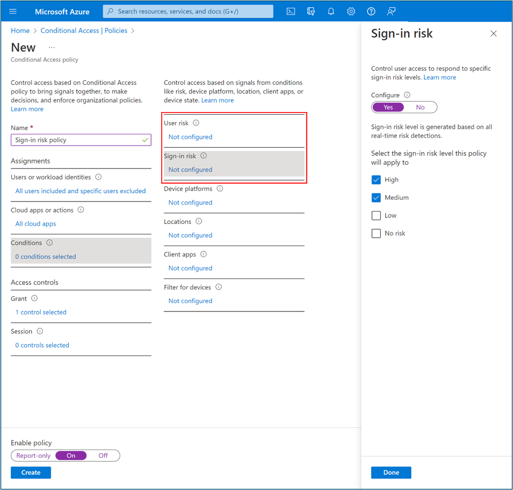

# Streamline employee and guest onboarding

> Secure and governed access to all applications and resources

## Introduction

In this guide, we describe how to configure Microsoft Entra Suite products for a scenario in which the fictional organization, Contoso, wants to hire new remote employees and provide them with secure and seamless access to necessary apps and resources.
They want to invite and collaborate with external users (such as partners, vendors, or customers) and provide them with access to relevant apps and resources. 

Contoso uses Microsoft Entra Verified ID to issue and verify digital proofs of identity and status for new remote employees (based on human resources data) and external users (based on email invitations). Digital wallets store identity proof and status to allow access to apps and resources. As an additional security measure, Contoso may verify identity with FaceCheck facial recognition based on the picture that the credential stores.

They use Microsoft Entra ID Governance to create and grant access packages for employees and external users based on verifiable credentials. 

For employees, they base access packages on job function and department or Lifecycle workflows. Access packages include cloud and on-premises apps and resources to which employees need access.

For external collaborators, they base access packages on based on invitation to define external user roles and permissions. The access packages include only apps and resources to which external users need access.

Employees and external users can request access packages through a self-service portal and provide their digital proofs as identity verification. With single sign-on and multifactor authentication, employees and external users use Microsoft Entra accounts to access apps and resources that their access packages include. Contoso verifies credentials and grants access packages without requiring manual approvals or provisioning.

Contoso uses Microsoft Entra Identity Protection and Conditional Access (CA) to monitor and protect accounts from risky sign-ins and user behavior. They enforce appropriate access controls based on location, device, and risk level

## Configure prerequisites

To successfully deploy and test the solution, configure the prerequisites that we describe in this section.

### Configure Microsoft Entra Verified ID

For this scenario, complete these prerequisite steps to configure Microsoft Entra Verified ID with Quick setup (Preview):

1. Register a custom domain (required for Quick setup) by following the steps in the [Add your custom domain](https://learn.microsoft.com/en-us/entra/fundamentals/add-custom-domain) article.

2.Sign in to the Microsoft Entra admin center with at least a Global Administrator role.

* Select **Verified ID**.
* Select **Setup**.
* Select **Get started**

3. If you have multiple domains registered for your Microsoft Entra tenant, select the one that you would like to use for Verified ID.

4. After the setup process is complete, you see a default workplace credential available to edit and offer to employees of your tenant on their **My Account** page.

	
	
5. Sign in to the test user�s **My Account** with their Microsoft Entra credentials. Select **Get my Verified ID** to issue a verified workplace credential
	
	

### Configure Microsoft Entra ID Protection

1. Administrators who interact with ID Protection must have one or more of the following role assignments depending on the tasks they're performing. To follow the [Zero Trust principle of least privilege](https://learn.microsoft.com/en-us/security/zero-trust/), consider using [Privileged Identity Management (PIM)](https://learn.microsoft.com/en-us/entra/id-governance/privileged-identity-management/pim-configure) to just-in-time activate privileged role assignments.

	1. Read ID Protection and Conditional Access policies and configurations

		1. [Security Reader](https://learn.microsoft.com/en-us/entra/identity/role-based-access-control/permissions-reference#security-reader)
		1. [Global Reader](https://learn.microsoft.com/en-us/entra/identity/role-based-access-control/permissions-reference#global-reader)

	1. [Manage ID Protection]

		1. [Security Operator](https://learn.microsoft.com/en-us/entra/identity/role-based-access-control/permissions-reference#security-operator)
		1. [Security Administrator](https://learn.microsoft.com/en-us/entra/identity/role-based-access-control/permissions-reference#security-administrator)

	1. Create or modify Conditional Access policies

		1. [Conditional Access Administrator](https://learn.microsoft.com/en-us/entra/identity/role-based-access-control/permissions-reference#conditional-access-administrator)
		1. [Security Administrator](https://learn.microsoft.com/en-us/entra/identity/role-based-access-control/permissions-reference#security-administrator)

2. A test user who isn't an administrator to verify policies work as expected before deploying to real users. If you need to create a user, see [Quickstart: Add new users to Microsoft Entra ID](https://learn.microsoft.com/en-us/entra/fundamentals/how-to-create-delete-users)

3. A group that the user is a member of. If you need to create a group, see [Create a group and add members in Microsoft Entra ID](https://learn.microsoft.com/en-us/entra/fundamentals/how-to-manage-groups).
	
## Add trusted external organization (B2B)
Follow these prerequisite steps to add a trusted external organization (B2B) for the scenario.
1.	Sign in to the Microsoft Entra admin center with at least a Security Administrator role.
2.	Go to **Identity > External Identities > Cross-tenant access settings**. Select **Organizational settings**
3.	Select **Add organization**.
4.	Enter the organization's full domain name (or tenant ID).
5.	Select the organization in the search results. Select **Add**.
6.	Confirm the new organization (that inherits its access settings from default settings) in **Organizational settings**.
	
	

## Create catalog
Follow these prerequisite steps to create an Entitlement management catalog for the scenario.
1.	Sign in to the Microsoft Entra admin center with at least an Identity Governance Administrator role.
2.	Go to **Identity governance > Entitlement management > Catalogs**.
3.	Select **+New catalog**.

	

4.	Enter a unique name for the catalog and provide a description. Requestors see this information in an access package's details.
5.	To create access packages in this catalog for internal users, select **Enabled for external users > No**.

	

6.	On **Catalog**, open the catalog to which you want to add resources. Select **Resources > +Add resources**.
7.	Select **Type**, then **Groups and Teams, Applications**, or **SharePoint sites**.
8.	Select one or more resources of the type that you want to add to the catalog. Select **Add**.

## Create access packages
To successfully deploy and test the solution, configure the access packages that we describe in this section.
## Access package for remote users (internal)
Follow these steps to create an access package in entitlement management with Verified ID for remote (internal) users.
1.	Sign in to the Microsoft Entra admin center with at least an Identity Governance Administrator role.
2.	Go to **Identity governance > Entitlement management > Access package**.
3.	Select **New access package**.
4.	For **Basics**, give the access package a name (such as Finance Apps for Remote Users). Specify the catalog that you previously created.
5.	For Resource roles, select a resource type (for example: Groups and Teams, Applications, SharePoint sites). Select one or more resources.
6.	In **Role**, select the role to which you want users assigned for each resource. 

    

7.	For **Requests**, select **For users in your directory**.
8.	In **Select users and groups**, select **For Users in your directory**. Select **+ Add users and groups**. Select an existing group entitled to request the access package.
9.	Scroll to **Required Verified Ids**.
10.	Select **+ Add issuer**. Select an issuer from the Microsoft Entra Verified ID network. Ensure that you select an issuer from an existing verified identity in the guest wallet.
11.	**Optional:** In **Approval**, specify whether approval is required when users request the access package. 
12.	**Optional:** In **Requestor information**, select **Questions**. Enter a question that you want to ask the requestor. This question is known as the display string. To **add localization** options, select Add localization.
13.	For **Lifecycle**, specify when a user's assignment to the access package expires. Specify whether users can extend their assignments. For **Expiration**, set **Access package assignments** expiration to **On date, Number of days, Number of hours, or Never**.
14.	In **Access Reviews**, select **Yes**.
15.	In **Starting on**, select the current date. Set **Review Frequency** to **Quarterly**. Set **Duration (in Days)** to **25**.

## Access package for guests (B2B) 
Follow these steps to create an access package in entitlement management with Verified ID for guests (B2B).
1.	Sign in to the Microsoft Entra admin center with at least an Identity Governance Administrator role.
2.	Go to **Identity governance > Entitlement management > Access package**.
3.	Select **New access package**.
4.	For **Basics**, give the access package a name (such as Finance Apps for Remote Users). Specify the catalog that you previously created.
5.	For **Resource roles**, select a resource type (for example: Groups and Teams, Applications, SharePoint sites). Select one or more resources.
6.	In **Role**, select the role to which you want users assigned for each resource. 
	
	

7.	For **Requests**, select **For users not in your directory**.
8.	Select **Specific connected organizations**. To select from a list of connected organizations that you previously added, select **Add directory**.
9.	Enter the name or domain name to search for a previously connected organization.
10.	Scroll to **Required Verified Ids**.
11.	Select **+ Add issuer**. Select an issuer from the Microsoft Entra Verified ID network. Ensure that you select an issuer from an existing verified identity in the guest wallet.
12.	**Optiona**l: In **Approval**, specify whether approval is required when users request the access package. 
13.	**Optional**: In **Requestor information**, select **Questions**. Enter a question that you want to ask the requestor. This question is known as the display string. To add localization options, select **Add localization**.
14.	For **Lifecycle**, specify when a user's assignment to the access package expires. Specify whether users can extend their assignments. For **Expiration**, set **Access package assignments expiration** to **On date, Number of days, Number of hours**, or **Never**.
15.	In **Access Reviews**, select **Yes**.
16.	In **Starting on**, select the current date. Set **Review Frequency** to **Quarterly**. Set **Duration (in Days)** to **25**.
17.	Select **Specific reviewers**. Select **Self Review**.
	
	

## Create lifecycle workflows

In this section, we describe how to create joiner and leaver workflows and run workflows on demand.

### Create joiner workflow

To create a joiner workflow, follow these steps.
1.	Sign in to the Microsoft Entra admin center with at least a Lifecycle Workflows Administrator role.
2.	Go to **Identity governance > Lifecycle workflows > Create a workflow**.
3.	For **Choose a workflow**, select **Onboard new hire employee**.

4.	For **Basics**, enter Onboard New hire employee – Finance for the workflow display name and description. Select **Next**.
5.	For **Configure scope > Rule**, enter values for **Property, Operator, and Value**. Change the expression of the scope to only users where **Property > department** has a Value of Finance. Ensure that your test user populates **Property** with the Finance string so that it’s in the workflow scope

6.	On **Review tasks**, select **Add task** to add a task to the template. For this scenario, we add **Request user access package assignment.**
7.	For **Basics**, select **Request user access package assignment**. Assign a name to this task (such as Assign Finance Access Package). Select a policy.
8.	In **Configure**, select the access package that you previously created.
9.	**Optional:** Add other joiner tasks as follows. For some of these tasks, ensure that important attributes such as **Manager** and **Email** are properly mapped to users as described in . [Automate employee onboarding tasks before their first day of work using Lifecycle Workflows APIs](https://learn.microsoft.com/en-us/graph/tutorial-lifecycle-workflows-onboard-custom-workflow?tabs=http#prerequisites). 

	* Enable User Account
	* Add user to groups or teams
	 Send Welcome Email
	* Generate TAP and Send Email 
10.	Select **Enable Schedule.**

11.	Select **Review + create.**

### Create leaver workflow (Optional)

To create a leaver workflow, follow these steps.

1.	Sign in to the Microsoft Entra admin center with at least a Lifecycle Workflows Administrator role.
2.	Go to **Identity governance > Lifecycle workflows > Create a workflow.**
3.	On **Choose a workflow**, select **Offboard an employee.**

4.	On **Basics**, enter Offboard an employee – Finance as display name and description for the workflow. Select **Next.**
5.	On **Configure scope > Rule**, enter values for **Property, Operator**, and **Value**. Change the expression of the scope to only users where Property > department has a **Value** of **Finance**. Ensure that your test user populates **Property** with the Finance string so that it’s in the workflow scope.

6.	On **Review tasks**, select **Add task** to add a task to the template. For this scenario we add **Request user access package assignment.**
7.	**Optional:** Add other leaver tasks such as:
	* Disable User Account
	* Remove user from all groups
	* Remove user from all Teams 
8.	Toggle on **Enable schedule.**

**Note:** Lifecycle workflows run automatically based on defined triggers that combine time-based attributes and an offset value. For example, if the attribute is **employeeHireDate** and offsetInDays is -1, then the workflow should trigger one day before the employee hire date. The value can range between -180 and 180 days. The values **employeeHireDate** and **employeeLeaveDateTime** must be set within Microsoft Entra ID for users. [How to synchronize attributes for Lifecycle workflows](https://learn.microsoft.com/en-us/entra/id-governance/how-to-lifecycle-workflow-sync-attributes) provides more information on attributes and processes.

### Run joiner workflow on demand

To test this scenario without waiting for the automated schedule, run on-demand lifecycle workflows.
1.	Initiate the previously created joiner workflow.
2.	Sign in to the Microsoft Entra admin center with at least a Lifecycle Workflows Administrator role.
3.	Go to **Identity governance > Lifecycle workflows > Workflows.**
4.	On **Workflow**, select Onboard New hire employee – Finance that you previously created.
5.	Select **Run on-demand.**
6.	On **Select users**, select **Add users.**
7.	On **Add users**, select the users for which you want to run the on-demand workflow.
8.	Select **Add.**
9.	Confirm your choices. Select **Run workflow.**
10.	Select **Workflow history** to verify task status.

11.	After all tasks complete, verify that the user has access to the applications that you selected in the access package. This completes the joiner scenario for the user to access necessary apps on day one.

## Review Existing Entra ID Protection Reports

It's important to review the ID Protection reports before deploying risk-based Conditional Access policies. This review gives an opportunity to investigate any existing suspicious behavior. You might choose to dismiss the risk or confirm these users as safe if you determine they aren't at risk

- [Investigate risk detections](https://learn.microsoft.com/en-us/entra/id-protection/howto-identity-protection-investigate-risk)
- [Remediate risks and unblock users](https://learn.microsoft.com/en-us/entra/id-protection/howto-identity-protection-remediate-unblock)
- [Make bulk changes using Microsoft Graph PowerShell](https://learn.microsoft.com/en-us/entra/id-protection/howto-identity-protection-graph-api)

## Create sign-in risk-based CA policy

1.	Sign in to the Microsoft Entra admin center with at least a Conditional Access (CA) Administrator role.
2.	Go to **Protection > Conditional Access**.
3.	Select **New policy**.
4.	Enter a **policy name** such as Protect applications for remote high-risk sign-in users.
5.	For **Assignments**, select **Users**.
6.	For **Include**, select a **remote user group** or **select all users**.
7.	For **Exclude**, select **Users and groups**. Select your organization's emergency access or break-glass accounts.
8.	Select **Done**.
9.	For **Cloud apps or actions> Include**, select the application(s) to target this policy.
10.	For **Conditions > Sign-in risk**, set **Configure** to **Yes**. For **Select the sign-in risk level this policy will apply to**, select **High and Medium**.
11.	Select **Done**.
12.	For **Access controls > Grant**.
13.	Select **Grant access > Require multifactor authentication**.
14.	For **Session**, select **Sign-in frequency**. Select **Every time**.
15.	Confirm settings. Select **Enable policy**
	- For more information visit the following article about [Configuring and enabling risk policies](https://learn.microsoft.com/en-us/entra/id-protection/howto-identity-protection-configure-risk-policies)

	 

16. **Optional:** ID Protection sends risk signals to Conditional Access, to make decisions and enforce organization policies. These policies might require users perform multifactor authentication or secure password change. Consider the following:
	- Policy exclusions
		- [Emergency access or break-glass](https://learn.microsoft.com/en-us/entra/identity/role-based-access-control/security-emergency-access) accounts to prevent lockout due to policy misconfiguration. In the unlikely scenario all administrators are locked out, your emergency-access administrative account can be used to log in and take steps to recover access.
		- Service accounts and Service principals, such as the Microsoft Entra Connect Sync Account. Service accounts are non-interactive accounts that aren't tied to any particular user. They're normally used by back-end services allowing programmatic access to applications, but are also used to sign in to systems for administrative purposes. Calls made by service principals won't be blocked by Conditional Access policies scoped to users. Use Conditional Access for workload identities to define policies targeting service principals.
			- If your organization has these accounts in use in scripts or code, consider replacing them with [managed identities](https://learn.microsoft.com/en-us/entra/identity/managed-identities-azure-resources/overview).
	- Multifactor Authentication
		- For users to self-remediate risk though, they must register for [Microsoft Entra multifactor authentication](https://learn.microsoft.com/en-us/entra/identity/authentication/howto-mfa-getstarted) before they become risky.
	- Known network locations
		- It's important to configure [named locations in Conditional Access](https://learn.microsoft.com/en-us/entra/identity/conditional-access/concept-assignment-network#how-are-these-locations-defined) and add your VPN ranges to [Defender for Cloud Apps](https://learn.microsoft.com/en-us/defender-cloud-apps/ip-tags#create-an-ip-address-range). Sign-ins from named locations that are marked as trusted or known, improve the accuracy of ID Protection risk calculations. These sign-ins lower a user's risk when they authenticate from a location marked as trusted or known. This practice reduces false positives for some detections in your environment.

## Request access package
After you configure an access package with a Verified ID requirement, end-users who are within the scope of the policy can request access in their **My Access** portal. While reviewing requests for approval, approvers can see the claims of the verified credentials that requestors present.
1.	As a remote user or guest, sign in to **myaccess.microsoft.com*.
2.	Search for the access package that you previously created (such as Finance Apps for Remote Users). You can browse the listed packages or use the search bar. Select **Request**.
3.	The system displays an information banner with a message such as, To request access to this access package you need to present your Verifiable Credentials. Select **Request Access**. Scan the QR Code with your phone to launch Microsoft Authenticator. Share your credentials.
	
	

4.	After you share your credentials, continue with the approval workflow.
5.	**Optional**: Simulate user risk by following these instructions: [Simulating risk detections in Microsoft Entra ID Protection](https://learn.microsoft.com/en-us/entra/id-protection/howto-identity-protection-simulate-risk). You may need to try multiple times to raise the user risk to medium or high.
6.	Try accessing the application that you previously created for the scenario to confirm blocked access. You may need to wait up to one hour for block enforcement.
7.	Validate that access is blocked by the Conditional Access (CA) policy that you created earlier using sign-in logs. Open non-interactive sign in logs from the ZTNA Network Access Client Private application. View logs from the Private Access application name that you previously created as the **Resource name**.
8. [Enable email notifications](https://learn.microsoft.com/en-us/entra/id-protection/howto-identity-protection-configure-notifications) so you can respond when a user is flagged as a risk. These notifications allow you to start investigating immediately. You can also set up weekly digest emails giving you an overview of risk for that week.
9. The [Impact analysis of risk-based access policies workbook](https://learn.microsoft.com/en-us/entra/id-protection/workbook-risk-based-policy-impact) helps administrators understand user impact before creating risk-based Conditional Access policies.
The [ID Protection workbook](https://learn.microsoft.com/en-us/entra/identity/monitoring-health/workbook-risk-analysis) can help monitor and look for patterns in your tenant. Monitor this workbook for trends and also Conditional Access Report Only mode results to see if there are any changes that need to be made, for example, additions to named locations.
You can also use the ID Protection APIs to [export risk information](https://learn.microsoft.com/en-us/entra/id-protection/howto-export-risk-data) to other tools, so your security team can monitor and alert on risk events.
 
 ## Resources

* [Microsoft Entra Verified ID | Microsoft Security](https://www.microsoft.com/en-us/security/business/identity-access/microsoft-entra-verified-id) 
* [Plan your Microsoft Entra Verified ID verification solution](https://learn.microsoft.com/en-us/entra/verified-id/plan-verification-solution) 
* [What is Microsoft Entra ID Protection?](https://learn.microsoft.com/en-us/entra/id-protection/overview-identity-protection) 
* [Microsoft Entra ID Governance](https://learn.microsoft.com/en-us/entra/id-governance/identity-governance-overview)
* [Plan a Microsoft Entra Conditional Access deployment](https://learn.microsoft.com/en-us/entra/identity/conditional-access/plan-conditional-access)
