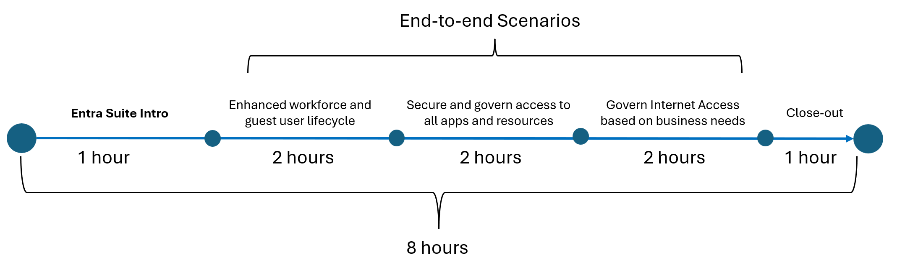
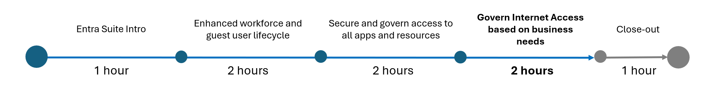

# Entra Suite POC Overview

## Microsoft Entra Suite Capabilities

## PoC | Timeline

## Logistics

- Each stage will only require participation of a subset of stakeholders from customer​s.
- There are some pre-requisites for each scenario​.
- We recommend completing phases 2-4 as close together as feasible.

## PoC | Pre-work

Identify resources to onboard. Recommendations​:

- Ensure all prerequisites are met for each scenario, and that the appropriate roles and stakeholders are available for this Proof of Concept (POC).

## PoC | Phase 1: Intro​

| Role  | Responsability |  
| ----- | -------- |
| Microsoft Entra ID Global Admin | -> Activate trials and initial setup |
| Security Team | -> Validate Entra suite secure access approach |
| Network Team | -> Validate Entra suite secure access aproach  |
| All mentioned roles above | -> Review Prerequisites and scenarios |

**Table 1:** Roles for Intro phase

## PoC | Phase 2: Enhanced workforce and guest lifecycle

| Role  | Responsability / Function |  
| ----- | -------- |
| Global Administrator or authentication policy administrator & application administrator | -> Configure Microsoft Entra Verified ID |
| Global Administrator Or Security Administrator | -> Add trusted External Organization (For B2B Scenario - Optional) |
| Global Administrator Or Identity Governance Administrator | -> Create Entitlement Management Catalog and Access Packages |
| Test End User | -> Test and Validate user onboarding process |

**Table 1:** Roles for Intro phase

## PoC | Phase 3: Modernize remote access

| Role / Pre-requisite  | Responsability / Function |  
| ----- | -------- |
| Global Administrator | -> Configure Global Secure Access|
| Groups or Users Administrator | -> Create test groups and users |
| Windows client device - W10,W11 - Entra Joined or Hybrid Joined  | -> Client test for private access |
| Windows Server 2012 R2 or later | -> Secure access connector server |
| Test End User | -> Test and validate Entra private access |

**Table 1:** Roles for Intro phase

## PoC | Phase 4: Govern Internet Access based on business needs

| Role / Pre-requisite  | Responsability / Function |  
| ----- | -------- |
| Global Administrator | -> Configure Global Secure Access|
| Groups or Users Administrator | -> Create test groups and users |
| Windows client device - W10,W11 - Entra Joined or Hybrid Joined  | -> Client test for private access |
| Test End User | -> Test and validate Entra internet access |

**Table 1:** Roles for Intro phase

## PoC | Phase 5: Close-out

## Wrap-up session (1 hour)

**Who?**

    * All teams
    * Leadership team

**Goal**
* Present top findings to leadership
* Discuss strategy to further implement
* Collect Feedback

